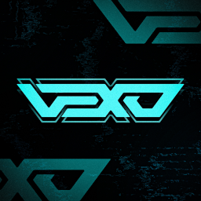

# Private-Music-bot-
Private Music bot i created for my friend just for fun
# Music-Bot

A simple discord music bot built by Asjad
- With Play/Resume/Pause/Stop/skip/join/filter
- With Ping/Help/Developer
- My other Repositories Coming soon

# **IMPORTANT**
[Join my Support Server](https://discord.gg/jMtducykRc)

## HOW TO SELFHOSt

- download `nodejs` v12 or higher, and `ffmpeg`

- install all dependeces with `npm install`

- start your Bot with `node index.js`

- Use your token in .env / DISCORD_TOKEN =(your token) / PREFIX = (your desired prefix)
- make an .env file and type / DISCORD_TOKEN =(your token) / PREFIX = (your desired prefix)

also change the files in config.json / the src code so that its change for a .env file 

**Discord Server:**
[https://discord.gg/jMtducykRc]( https://discord.gg/sSYD6jH68m )

**Vexo Server:**
[https://discord.gg/pu4TRUPh4f]( https://discord.gg/pu4TRUPh4f )

**Website:**
[Website](https://www.asjadowo.xyz/)
